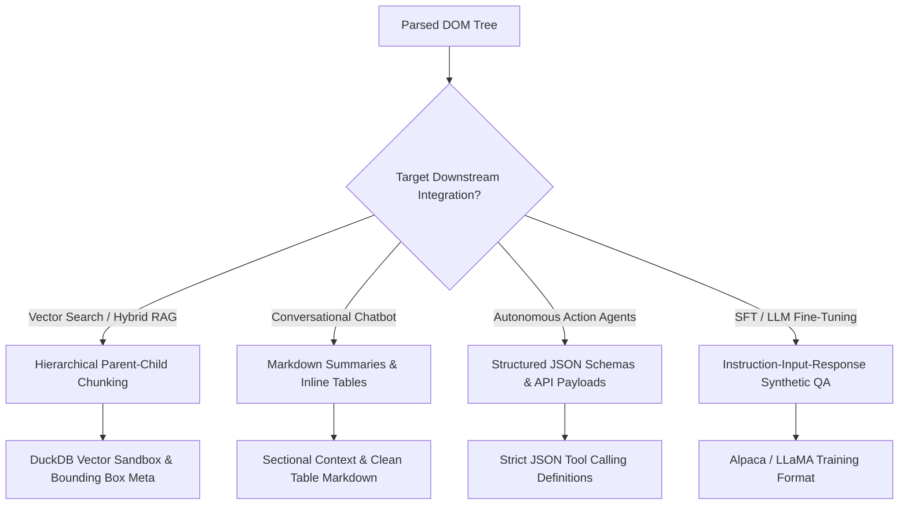
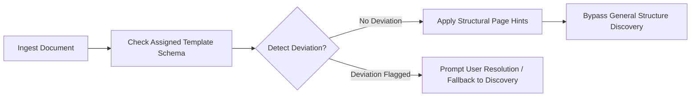

# Data Storage & Downstream Packing Decision Tree

This document defines how parsed PDF structural DOM objects are serialized, stored, chunked, and formatted for downstream AI consumption in `cernodata-internal`.

---

## 1. Downstream Use-Case Target Matrix

How extracted document content is structured depends entirely on the downstream target system:



### Downstream Strategy Specifications

| Downstream System | Target Chunk Size | Overlap | Special Formatting / Metadata | Primary Storage Backend |
| :--- | :--- | :--- | :--- | :--- |
| **Vector Search / Hybrid RAG** | Child: 300 tokens<br>Parent: Full section | 50 tokens (Child) | Bounding box coordinates $(x_0, y_0, x_1, y_1)$, page index, section path | DuckDB (Vector extension) / Parquet |
| **Conversational Chatbot** | 1000–2000 tokens | 100 tokens | Markdown headers (`#`, `##`), clean GFM tables, inline figure captions | SQLite / JSONL |
| **Autonomous Action Agents** | Schema-bounded | N/A | Strict JSON schema, key-value extractions, form field IDs | JSON Schema / PostgreSQL |
| **SFT / Fine-Tuning Datasets** | Synthetic Pairs | N/A | Prompt/Completion JSONL, Instruction context | JSONL (`alpaca` or `chatml` format) |

---

## 2. Structural DOM Representation & Primitive Schema

All parsing presets output a unified intermediate representation (IR) representing the document DOM.

### Geometric DOM Object Schema (`DocumentDOM`)

```json
{
  "document_id": "doc_982341",
  "source_filename": "q4_financial_report.pdf",
  "total_pages": 12,
  "nodes": [
    {
      "node_id": "node_p3_n4",
      "type": "table_grid",
      "global_page_index": 3,
      "temp_slice_index": 1,
      "bounding_box": {
        "x0": 54.2,
        "y0": 120.5,
        "x1": 558.0,
        "y1": 410.2
      },
      "content": {
        "raw_text": "Operating Income ...",
        "markdown_table": "| Segment | Q3 ($M) | Q4 ($M) |\n|---|---|---|\n| Cloud | 120.4 | 145.2 |",
        "rows": 2,
        "columns": 3,
        "cell_alignment_score": 0.98
      },
      "template_hint_applied": "balance_sheet_v1"
    }
  ]
}
```

### Supported DOM Primitive Types
- `heading`: Section title (`level`: 1–6).
- `paragraph`: Body text block.
- `multi_column_group`: Container for multi-column layouts.
- `table_grid`: Structured grid containing aligned cells.
- `figure`: Image, diagram, or chart with bounding box and optional caption.
- `header_footer`: Page running header/footer (flagged for optional exclusion during RAG chunking).

---

## 3. Standardized Document Template Hints & Misapplication Detection

For recurring document types (e.g. quarterly financial statements, standardized tax forms):



### Template Misapplication Detection Heuristics
A document is flagged as violating its assigned template when:
1. **Keyword Anchor Missing**: Expected static string anchors on designated pages are absent (e.g., missing *"Consolidated Balance Sheet"* on Page 3).
2. **Bounding Box Shift Delta > 15%**: Mandatory table region bounding box coordinates shift beyond geometric tolerance.
3. **Table Column Mismatch**: Column headers do not match expected template schema keys.

---

## 4. Standalone Script Exporter & Data Pipeline Storage

In addition to internal state storage in DuckDB / SQLite, every parsing configuration can be exported as a zero-dependency standalone Python script:

```python
# Standalone Export Example: parse_preset_docling_tesseract.py
# Audit-friendly, self-contained execution script.

import sys
import json
# Reads raw PDF, executes preset pipeline, outputs standardized DocumentDOM JSON
```

### Export Pipeline Artifacts
- `preset_config.yaml`: Declarative setup configuration.
- `parse_preset_<name>.py`: Self-contained audit-friendly execution script.
- `output_dom.json`: Standardized IR document tree.
- `output_chunks.jsonl`: Final packed chunks formatted for the target downstream system.
