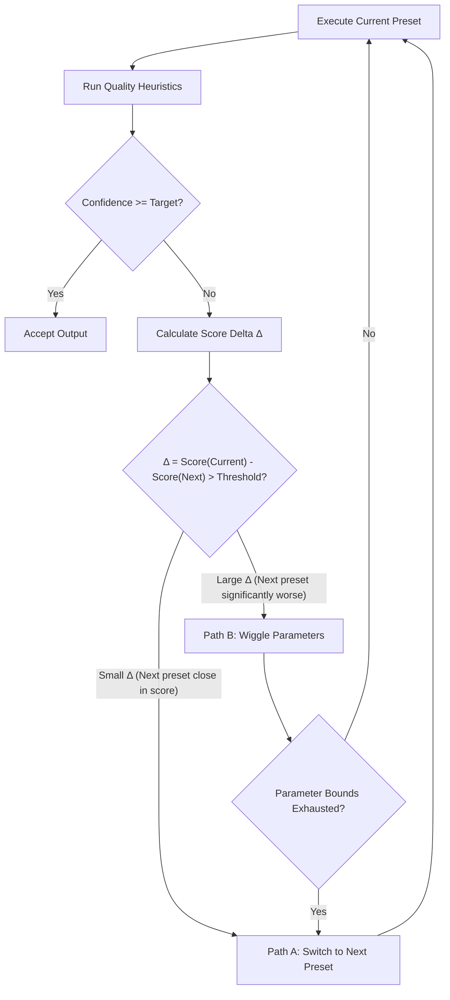
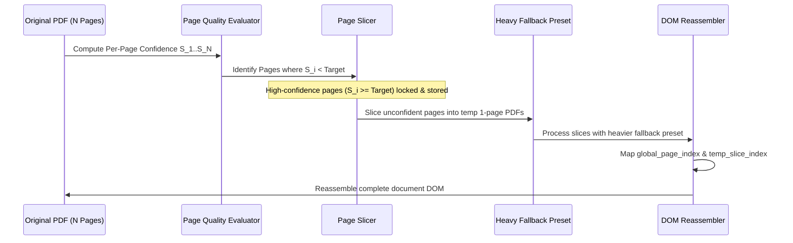

# Parsing Decision Tree & Pipeline Selection Specification

This document details the selection, scoring, parameter wiggling, preset switching, and page-subdivision mechanics for parsing PDFs within `cernodata-internal`.

---

## 1. Preset Selection Inputs & Document Taxonomy

The initial setup wizard collects four primary inputs to evaluate document characteristics and system environment:

1. **Document Taxonomy**:
   - `financial_report`: Dense numbers, tables, multi-page financial statements.
   - `multicolumn_article`: Academic or corporate papers with 2+ text columns.
   - `scanned_form`: Low-DPI scanned documents, hand-signed forms, low contrast.
   - `tabular_ledger`: Primarily spreadsheet-like grid structures.
   - `mixed_text_image`: Marketing materials, slide decks, embedded graphics.

2. **Hardware Profile**:
   - `low_spec_cpu`: Shared CPU/RAM, no discrete GPU ($\le 4\text{GB}$ RAM ceiling).
   - `workstation_cuda`: Local CUDA-enabled GPU (NVIDIA RTX/Tesla).
   - `cloud_cluster`: Distributed cloud node / multi-GPU execution.

3. **Quality vs. Speed Target**:
   - `rapid_approximate`: Fast throughput, acceptable minor structural drift.
   - `high_precision_structure`: Maximum layout fidelity, exact bounding box extraction.

4. **Security Constraints**:
   - `air_gapped_local`: Zero external network calls (strictly local models/engines).
   - `hosted_vision_api`: Cloud multimodal APIs allowed (e.g. OpenAI / Claude / Google Vision).

---

## 2. Preset Selection Probability Scoring $P(\text{Preset}_i \mid \text{Answers})$

Given user inputs $\mathbf{A} = \{ \text{Taxonomy}, \text{Hardware}, \text{Target}, \text{Security} \}$, candidate presets are assigned initial confidence scores:

$$\text{Score}(\text{Preset}_i) = \sum_{k \in \mathbf{A}} w_{i,k} \cdot S(i, k)$$

### Preset Candidates Matrix

| Preset ID | Primary Layout Engine | Primary OCR Engine | Compute Heavy? | Air-Gapped? |
| :--- | :--- | :--- | :--- | :--- |
| `docling_fast` | Docling Layout | Tesseract / RapidOCR | Low (CPU) | Yes |
| `docling_deep` | Docling Layout | Surya / EasyOCR | High (GPU) | Yes |
| `vision_llm_direct` | Qwen2-VL / PaddleOCR-v4 | Multimodal Vision LLM | High (GPU/API) | Conditional |
| `custom_user_preset` | User-configured | User-configured | Variable | Variable |

### Baseline Weight Table ($w_{i,k}$)

```yaml
weights:
  docling_fast:
    low_spec_cpu: 0.9
    rapid_approximate: 0.8
    financial_report: 0.6
    scanned_form: 0.3
  docling_deep:
    workstation_cuda: 0.9
    high_precision_structure: 0.85
    financial_report: 0.85
    tabular_ledger: 0.9
  vision_llm_direct:
    scanned_form: 0.95
    mixed_text_image: 0.9
    low_spec_cpu: 0.1
    air_gapped_local: 0.5 # lower if local vision LLM is too heavy for host
```

The system ranks presets by total score and outputs a pipeline YAML:

```yaml
pipeline_config:
  primary_preset: "docling_deep"
  fallback_queue:
    - preset: "docling_fast"
      score: 0.72
    - preset: "vision_llm_direct"
      score: 0.45
  target_confidence_threshold: 0.82
```

---

## 3. Confidence-Guided Fallback Mechanics: Wiggling vs. Switching

When a document (or single page) scores below `target_confidence_threshold` during quality checks, the system decides whether to execute **Path B (Parameter Wiggling)** or **Path A (Preset Switching)**.



### 3.1 Delta-Based Routing Decision ($\Delta$)

$$\Delta = \text{Score}(\text{Preset}_{\text{current}}) - \text{Score}(\text{Preset}_{\text{next}})$$

- **Large $\Delta$ ($\ge 0.20$)**: The current preset is significantly better matched to the user's environment/taxonomy than the next fallback candidate.
  - **Action**: Prioritize **Path B (Parameter Wiggling)** on the current preset first.
- **Small $\Delta$ ($< 0.20$)**: The next preset candidate is nearly as suitable as the current one.
  - **Action**: Prioritize **Path A (Preset Switching)** early to evaluate an alternative engine before spending compute on fine-grained wiggling.

### 3.2 Path B: Parameter Wiggling Range Definitions

When parameter wiggling is triggered, parameters are adjusted within strictly bounded ranges:

| Parameter | Default Value | Min Bound | Max Bound | Step Size | Use Case |
| :--- | :--- | :--- | :--- | :--- | :--- |
| `rendering_dpi` | 150 DPI | 100 DPI | 300 DPI | +50 DPI | Low OCR readability, blurry text |
| `binarization_threshold` | 128 | 90 | 180 | $\pm 15$ | Scanned forms with background noise |
| `contrast_enhancement` | 1.0 (Off) | 1.0 | 2.0 | +0.25 | Faded text, light ink |
| `table_detection_mode` | `auto` | `fast` | `strict_grid` | Enum | Fragmented table cell borders |

Once all parameter bounds for the current preset are exhausted, the system defaults back to Path A (Preset Switch).

---

## 4. Page-Level PDF Subdivision & Reassembly

To prevent expensive full-document re-runs when only isolated pages fail:



### Provenance Mapping Guarantee
Every extracted node maintains dual indices:
- `global_page_index`: Original page position in the input document (1-indexed).
- `temp_slice_index`: Temporary single-page slice context.

This guarantees that geometric bounding boxes $(x_0, y_0, x_1, y_1)$ align perfectly without page-number drift upon final reassembly.
