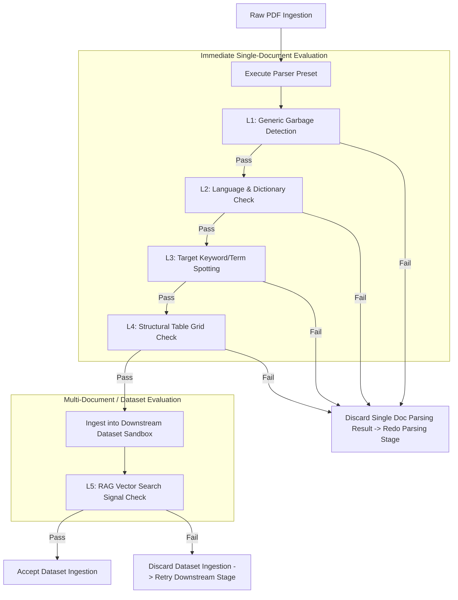
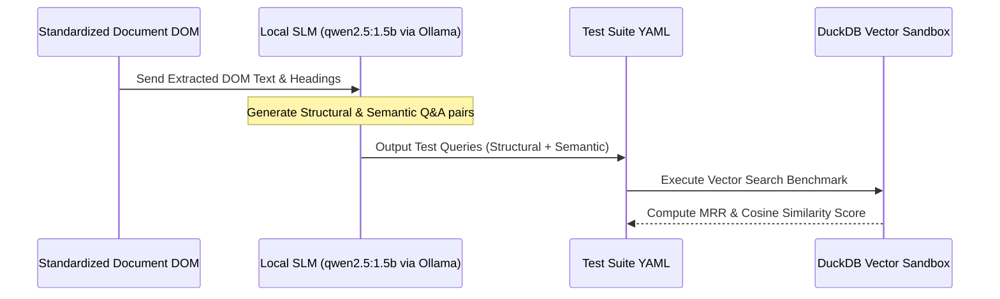

# Testing & Quality Evaluation Decision Tree

This document defines the 5-tier quality continuum, early single-doc vs. downstream dataset-level failure handling, and SLM test prompt generation in `cernodata`.

---

## 1. Tiered Quality Check Continuum & Evaluation Stages

Quality checks are categorized by **how early** quality degradation can be detected. Checks run either at the **Single Document Parsing Stage** (immediate feedback) or at the **Dataset Ingestion Stage** (downstream RAG/eval feedback).

---

## 2. Quality Check Level Specifications & Configurable Thresholds

Each test can be individually toggled, configured with custom thresholds, and assigned a specific failure action based on its evaluation stage:

| Check Level | Name | Evaluation Stage | Metric / Heuristic | Default Threshold | Failure Action |
| :--- | :--- | :--- | :--- | :--- | :--- |
| **Level 1** | **Generic Garbage Detection** | Single Doc (Immediate) | Ratio of non-printable characters & ungrammatical unicode symbols | $\le 0.05$ (5% max) | **Discard Single Doc Result** $\rightarrow$ Trigger Parameter Wiggle or Preset Switch immediately. |
| **Level 2** | **Language & Dictionary Check** | Single Doc (Immediate) | Dictionary word hit rate based on user language hints (`en`, `de`, `fr`) | $\ge 0.80$ (80% hit) | **Discard Single Doc Result** $\rightarrow$ Redo parsing stage for current document/page. |
| **Level 3** | **Target Keyword / Term Spotting** | Single Doc (Immediate) | Regex / keyword presence check (e.g. required section headers or invoice IDs) | 100% required terms | **Discard Single Doc Result** $\rightarrow$ Redo parsing stage for current document. |
| **Level 4** | **Structural Table Grid Check** | Single Doc (Immediate) | Bounding box cell alignment ratio vs. fragmented text blocks | $\ge 0.85$ alignment | **Discard Single Doc Result** $\rightarrow$ Enable `strict_grid` parameter wiggle or switch engine. |
| **Level 5** | **RAG Vector Search Signal Check** | Dataset Ingestion (Downstream) | Similarity score & MRR against test query suite in DuckDB vector sandbox | MRR $\ge 0.70$ | **Discard Parsing Ingestion** $\rightarrow$ Retry at downstream packing/chunking dataset stage. |

---

## 3. Early Discard vs. Downstream Dataset Retry Mechanics

### 3.1 Single Document Parsing Stage (Levels 1–4)
- **Execution**: Evaluated in-memory immediately after extracting text/layout for a page or document.
- **Why Early?**: Garbage characters, language mismatches, missing key fields, or broken table grids can be identified instantly without wasting compute on downstream embedding generation or vector indexing.
- **Loop Action**: The parsing result is discarded instantly. The system triggers **Path B (Parameter Wiggling)** if confidence is close to the threshold, or **Path A (Preset Switch)** if parameter bounds are exhausted or next preset score delta is small.

### 3.2 Dataset Ingestion Stage (Level 5)
- **Execution**: Evaluated after documents are chunked and ingested into a local DuckDB vector sandbox.
- **Why Downstream?**: Vector search signal check requires a complete dataset context and test query set to measure retrieval effectiveness (MRR / Hit Rate @ K).
- **Loop Action**: Parsing output ingestion is discarded for the affected batch. The retry occurs at the dataset downstream packing/chunking stage (e.g., adjusting child chunk sizes or summary depth) rather than re-running low-level OCR unless lower-level checks were also invalidated.

---

## 4. SLM-Driven Test Suite Prompt Generation

To eliminate manual test creation overhead, a lightweight local Small Language Model (SLM) via Ollama API (`qwen2.5:1.5b` or `llama3.2:1b`) automatically generates test suites from extracted text:

### Test Query Types Generated by SLM
1. **Structural Queries**:
   - Verification of numeric table values (e.g., *"What is the Total Operating Expense in Q4?"*).
   - Key-Value pair schema checks.
2. **Semantic Queries**:
   - Synthesis across multi-page sections (e.g., *"Summarize the risk factors associated with cloud expansion."*).
